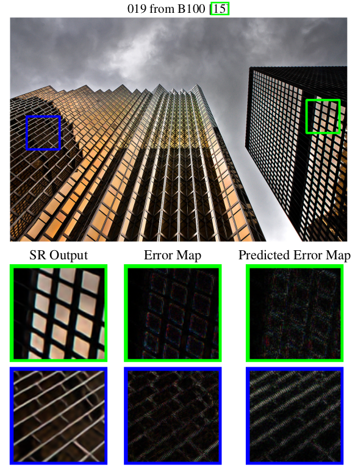
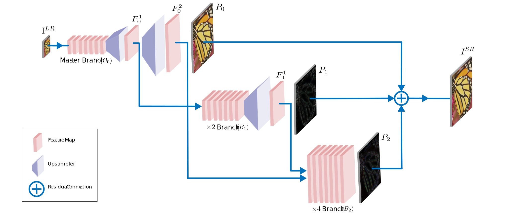
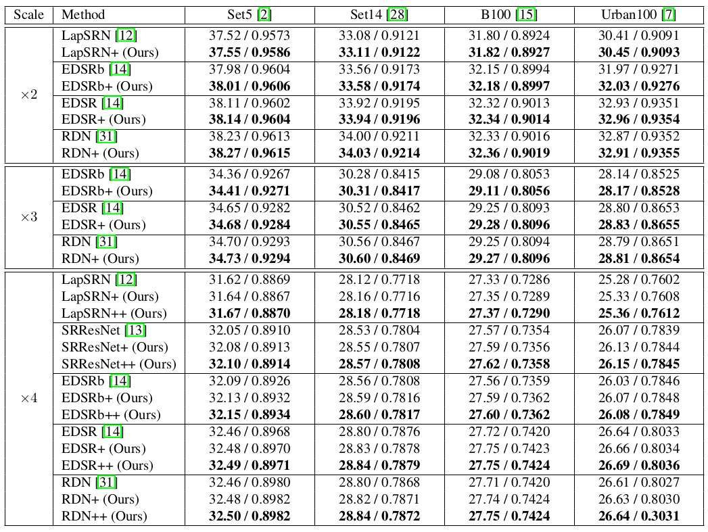
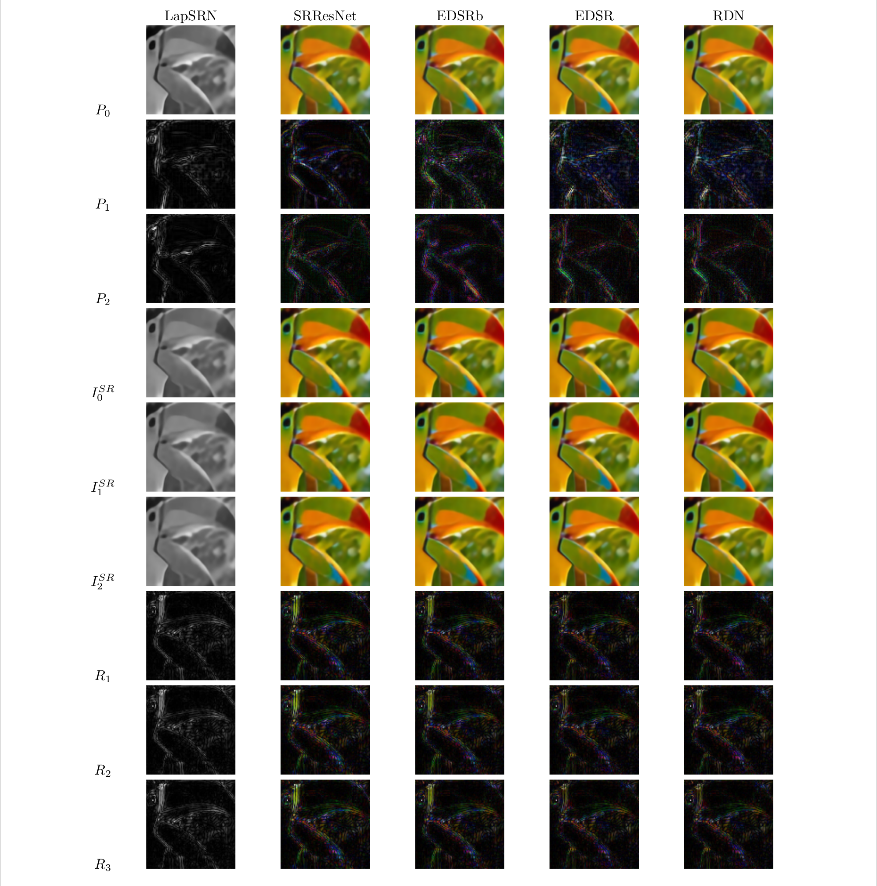
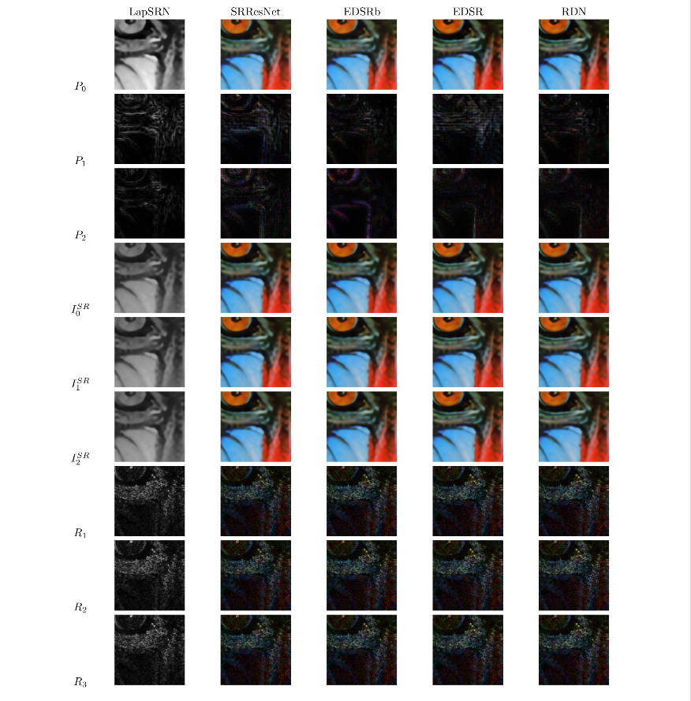
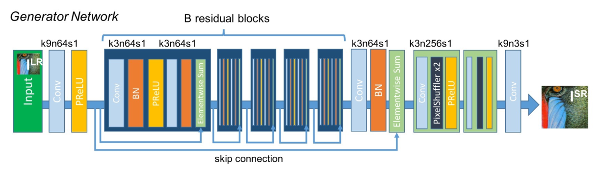
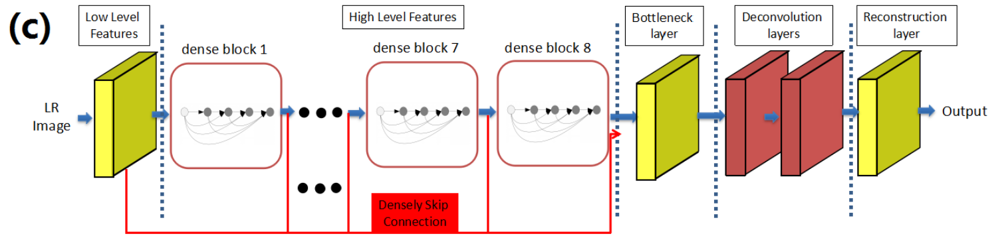
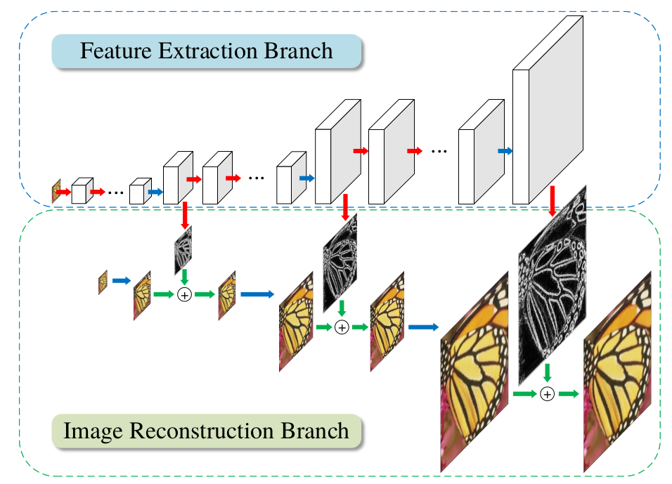
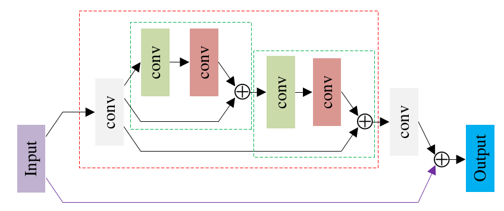
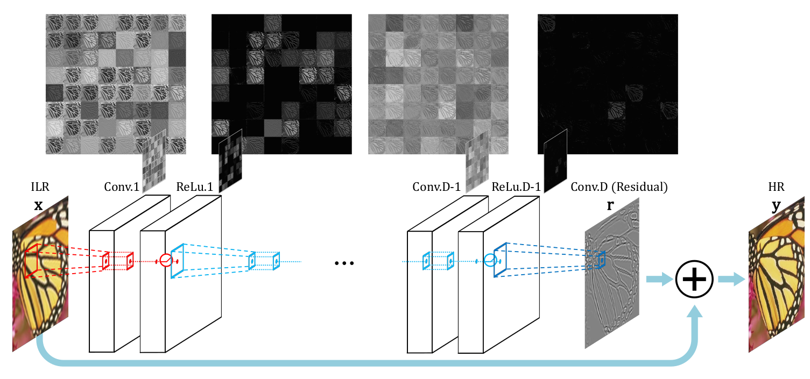

# Improving Super-Resolution Methods via Incremental Residual Learning



Recently, deep Convolutional Neural Networks (CNNs) have shown promising performance in accurate reconstruction of high resolution (HR) image, given its low resolution (LR) counter-part. However, recent state-of-the-art methods operate primarily on LR image for memory efficiency, but we show that it comes at the cost of performance. Furthermore, because spatial dimensions of input and output of such networks do not match, it's not possible to learn residuals in image space; we show that learning residuals in image space leads to performance enhancement. To this end, we propose a novel Incremental Residual Learning (IRL) framework to solve the above mentioned issues. In IRL, a set of branches i.e arbitrary image-to-image networks are trained sequentially where each branch takes spatially upsampled higher dimensional feature maps as input and predicts the residuals of all previous branches combined. We plug recent state of the art methods as base networks in IRL framework and demonstrate the consistent performance enhancement through extensive experiments on public benchmark datasets to set a new state of the art for super-resolution. Compared to the base networks our method incurs no extra memory overhead as only one branch is trained at a time. Furthermore, as our method is trained to learned residuals, complete set of branches are trained in only 20% of time relative to base network. 

Please view the full paper [here](https://arxiv.org/abs/1808.07110)

If you find our work useful, please consider citing: 

```
@article{muneeb2018irl,
  title={Improving Super-Resolution Methods via Incremental Residual Learning},
  author={M. Aadil, R. Rahim, S. Hussain},
  journal={arXiv preprint arXiv:1808.07110},
  year={2018}
}
```

# Getting Started 



## Dependencies
* Python (Tested with 3.6)
* PyTorch >= 0.4.0
* numpy
* scipy
* matplotlib
* tqdm

## Datasets

[DIV2K - Agustsson et al. CVPRW 2017](https://data.vision.ee.ethz.ch/cvl/DIV2K/)

[Set5 - Bevilacqua et al. BMVC 2012](http://people.rennes.inria.fr/Aline.Roumy/results/SR_BMVC12.html),

[Set14 - Zeyde et al. LNCS 2010](https://sites.google.com/site/romanzeyde/research-interests),

[B100 - Martin et al. ICCV 2001](https://www2.eecs.berkeley.edu/Research/Projects/CS/vision/bsds/),

[Urban100 - Huang et al. CVPR 2015](https://sites.google.com/site/jbhuang0604/publications/struct_sr).

Place the datasets under `datasets` directory, like so: 

```
datasets/
    benchmark/
        Set5/
        Set14/
        B100/
        Urban100/
    DIV2K/
        DIV2K_train_HR/
        DIV2K_train_LR_bicubic/
            X2/
            X3/
            X4/
```

# Training

Training IRL requires two following steps. 

## Train Master Branch (Original State of the Art)

```shell
#RDN 
python main.py --model RDN --patch_size 128 --epochs 200 --save RDN_x4 --reset --chop

#EDSR
python main.py --model EDSR --n_resblocks 32 --n_feats 256 --res_scale 0.1 --save EDSR_x4 --reset --chop

#EDSRb 
python main.py --model EDSR --save EDSRb_x4 --reset

#SRResNet
python main.py --model SRResNet --save SRResNet_x4 --reset

#LapSRN
python main.py --model LapSRN --patch_size 128 --n_channel_in 1 --n_channel_out 1 --n_layers 10 --loss 1*MSE --epochs 300 --save LapSRN_x4 --reset
```

## Train Residual Branches (Ours)

Train the same way as original networks, except simply enable `--enable_branches` flag and mention some options.

```shell
#RDN 
#branch1
python main.py --model RDN --patch_size 128 --enable_branches --n_branches 1 --half_resblocks --master_branch_pretrain ../experiment/model/RDN_x4.pt --loss 1*MSE --epochs 20 --batch_size 8 --save RDN_x4_b1 --reset --chop
#branch2
python main.py --model RDN --patch_size 128 --enable_branches --n_branches 2 --half_resblocks --pre_train ../experiment/RDN_x4_b1/model/model_best.pt --loss 1*MSE --epochs 20 --batch_size 8 --save RDN_x4_b1 --reset --chop

#EDSR
#branch1
python main.py --model EDSR --patch_size 96 --n_resblocks 32 --n_feats 256 --res_scale .1 --enable_branches --n_branches 1 --half_resblocks --master_branch_pretrain ../experiment/model/EDSR_x4.pt --loss 1*MSE --epochs 30 --save EDSR_x4_b1 --reset --chop
#branch2
python main.py --model EDSR --patch_size 96 --n_resblocks 32 --n_feats 256 --res_scale .1 --enable_branches --n_branches 2 --half_resblocks --pre_train ../experiment/EDSR_x4_b1/model/model_best.pt --loss 1*MSE --epochs 30 --save EDSR_x4_b2 --reset --chop

#EDSRb 
#branch1
python main.py --model EDSR --patch_size 96 --enable_branches --n_branches 1 --half_resblocks --master_branch_pretrain ../experiment/model/EDSR_baseline_x4.pt --loss 1*MSE --epochs 30 --save EDSRb_x4_b1 --reset
#branch2
python main.py --model EDSR --patch_size 96 --enable_branches --n_branches 2 --half_resblocks --pre_train ../experiment/EDSRb_x4_b1/model/model_best.pt --loss 1*MSE --epochs 30 --save EDSRb_x4_b2 --reset

#SRResNet
#branch1
python main.py --model SRResNet --patch_size 96 --enable_branches --n_branches 1 --half_resblocks --master_branch_pretrain ../experiment/model/SRResNet_x4.pt --loss 1*MSE --epochs 30 --save SRResNet_x4_b1 --reset
#branch2
python main.py --model SRResNet --patch_size 96 --enable_branches --n_branches 2 --half_resblocks --pre_train ../experiment/SRResNet_x4_b1/model/model_best.pt --loss 1*MSE --epochs 30 --save SRResNet_x4_b2 --reset

#LapSRN
#branch1
python main.py --model LapSRN --patch_size 128 --rgb_range 1 --n_channel_in 1 --n_channel_out 1 --n_layers 10 --half_resblocks --enable_branches --n_branches 1 --master_branch_pretrain ../experiment/model/LapSRN_x4.pt --loss 1*MSE --epochs 30 --save LapSRN_x4_b1 --reset
#branch2
python main.py --model LapSRN --patch_size 128 --rgb_range 1 --n_channel_in 1 --n_channel_out 1 --n_layers 10 --half_resblocks --enable_branches --n_branches 2 --pre_train ../experiment/LapSRN_x4_b1/model/model_best.pt --loss 1*MSE --epochs 30 --save LapSRN_x4_b2 --reset
```

# Evaluation

For each model (along with its 2 residual branches), evaluation scripts (on Set5) are mentioned below:

```shell
#LapSRN
#python main.py --model LapSRN --rgb_range 1 --n_channel_in 1 --n_channel_out 1 --n_layers 10 --n_feats 64 --pre_train ../experiment/model/LapSRN_x4.pt --save test/Set5/LapSRN_x4 --save_results --save_residuals --reset --test_only --data_test Set5
#python main.py --model LapSRN --rgb_range 1 --n_channel_in 1 --n_channel_out 1 --n_layers 10 --n_feats 64 --half_resblocks --enable_branches --n_branches 1 --pre_train /datadrive/sr-experiments/final_models/LapSRN_x4_b1/model/model_best.pt --save test/Set5/LapSRN_x4_b1 --save_results --save_residuals --reset --test_only --data_test Set5
#python main.py --model LapSRN --rgb_range 1 --n_channel_in 1 --n_channel_out 1 --n_layers 10 --n_feats 64 --half_resblocks --enable_branches --n_branches 2 --pre_train /datadrive/sr-experiments/final_models/LapSRN_x4_b2/model/model_best.pt --save test/Set5/LapSRN_x4_b2 --save_results --save_residuals --save_branches --reset --test_only --data_test Set5

#SRResNet
#python main.py --model SRResNet --pre_train ../experiment/model/SRResNet_x4.pt --save test/Set5/SRResNet_x4 --save_results --save_residuals --reset --test_only --data_test Set5
#python main.py --model SRResNet --half_resblocks --enable_branches --n_branches 1 --pre_train /datadrive/sr-experiments/final_models/SRResNet_x4_b1/model/model_best.pt --save test/Set5/SRResNet_x4_b1 --save_results --save_residuals --reset --test_only --data_test Set5
#python main.py --model SRResNet --half_resblocks --enable_branches --n_branches 2 --pre_train /datadrive/sr-experiments/final_models/SRResNet_x4_b2/model/model_best.pt --save test/Set5/SRResNet_x4_b2 --save_results --save_residuals --save_branches --reset --test_only --data_test Set5

#EDSRb 
#python main.py --model EDSR --pre_train ../experiment/model/EDSR_baseline_x4.pt --save test/Set5/EDSRb_x4 --save_results --save_residuals --reset --test_only --data_test Set5
#python main.py --model EDSR --half_resblocks --enable_branches --n_branches 1 --pre_train /datadrive/sr-experiments/final_models/EDSRb_x4_b1/model/model_best.pt --save test/Set5/EDSRb_x4_b1 --save_results --save_residuals --reset --test_only --data_test Set5
#python main.py --model EDSR --half_resblocks --enable_branches --n_branches 2 --pre_train /datadrive/sr-experiments/final_models/EDSRb_x4_b2/model/model_best.pt --save test/Set5/EDSRb_x4_b2 --save_results --save_residuals --save_branches --reset --test_only --data_test Set5

#EDSR
#python main.py --model EDSR --n_resblocks 32 --n_feats 256 --res_scale .1 --pre_train ../experiment/model/EDSR_x4.pt --save test/Set5/EDSR_x4 --save_results --save_residuals --reset --test_only --data_test Set5
#python main.py --model EDSR --n_resblocks 32 --n_feats 256 --res_scale .1 --half_resblocks --enable_branches --n_branches 1 --pre_train /datadrive/sr-experiments/final_models/EDSR_x4_b1/model/model_best.pt --save test/Set5/EDSR_x4_b1 --save_results --save_residuals --reset --test_only --data_test Set5
#python main.py --model EDSR --n_resblocks 32 --n_feats 256 --res_scale .1 --half_resblocks --enable_branches --n_branches 2 --pre_train /datadrive/sr-experiments/final_models/EDSR_x4_b2/model/model_best.pt --save test/Set5/EDSR_x4_b2 --save_results --save_residuals --save_branches --reset --test_only --data_test Set5

#RDN
#python main.py --model RDN --n_denseblocks 16 --n_layers 8 --n_feats 64 --growth_rate 64 --pre_train ../experiment/model/RDN_x4.pt --save test/Set5/RDN_x4 --save_results --save_residuals --reset --test_only --data_test Set5
#python main.py --model RDN --n_denseblocks 16 --n_layers 8 --n_feats 64 --growth_rate 64 --enable_branches --n_branches 1 --half_resblocks --pre_train /datadrive/sr-experiments/final_models/RDN_x4_b1/model/model_best.pt --save test/Set5/RDN_x4_b1 --save_results --save_residuals --reset --test_only --data_test Set5
#python main.py --model RDN --n_denseblocks 16 --n_layers 8 --n_feats 64 --growth_rate 64 --enable_branches --n_branches 2 --half_resblocks --pre_train /datadrive/sr-experiments/final_models/RDN_x4_b2/model/model_best.pt --save test/Set5/RDN_x4_b2 --save_results --save_residuals --save_branches --reset --test_only --data_test Set5
```

For other datasets, please see the file `eval.sh`.

# Results







# Other State of the Arts Implemented in this Repository

## RDN 


## EDSR


## SRResNet


## SRDenseNet


## LapSRN 


## DRRN 


## VDSR 


# Acknowledgments

This code is extended from [Pytorch Version of EDSR](https://github.com/thstkdgus35/EDSR-PyTorch) who we thank
